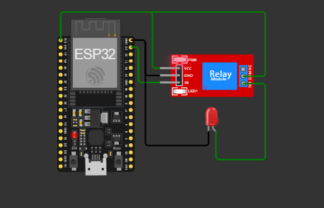
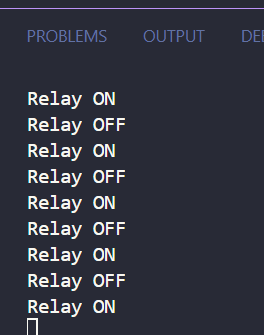

# Relay-Lamp-ESP32
A simple ESP32 project to control an AC appliance using a relay module, along with an LED indicator. This project demonstrates how to safely control high-voltage devices (like a lamp) with a low-voltage microcontroller. The LED is used as a visual indicator of the relay's state. The code is written in C++ and runs on the Arduino IDE.

## ⚙️ Hardware Diagram

> **Figure**: Wiring diagram of ESP32 with Relay module and AC Lamp

---

## 💻 Terminal Output

> **Figure**: Serial Monitor Output after uploading the sketch
